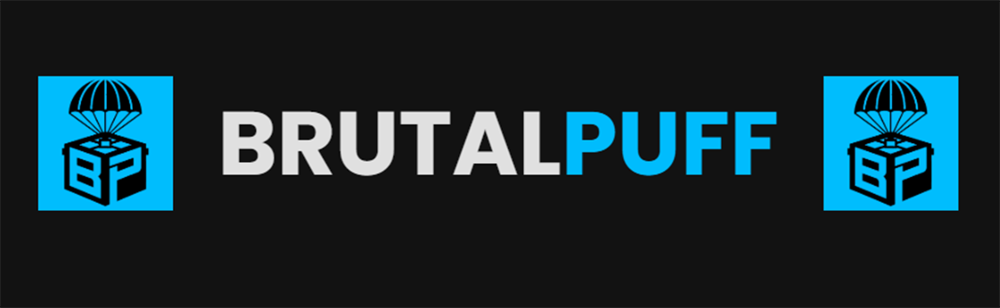

<h1>BrutalPUFF</h1><blockquote>
The Ultimate Post-Match Analyst for PUBG, with deep Twitch integration. Get detailed summaries and clips of your streamer encounters delivered directly through Steam.
</blockquote><h2> Key Features</h2><ul><li>
<strong>Automated Steam Bot:</strong> The core of the service. Add the bot on Steam, link your PUBG account, and get notified automatically after every match.
</li><li>
<strong>Dynamic Match Summaries:</strong> Generates a unique, professional webpage for each match, detailing your performance, combat stats, and social interactions.
</li><li>
<strong>Player Profile Pages:</strong> Track your career stats (K/D, ADR, Avg. Position) and browse a full history of all your analyzed matches.
</li><li>
<strong>Deep Twitch Integration:</strong>
<ul><li>
<strong>Streamer Encounter Clips:</strong> If you kill or are killed by a streamer who was live, the bot embeds the Twitch VOD of that exact moment directly in your match summary.
</li><li>
<strong>Lobby Social Map:</strong> Discover which other known streamers were in your lobby, see who was online (with viewer counts), and get a count of those who were offline.
</li></ul></li></ul><h2> Live Examples</h2>
Check out the live application and see some examples of what BrutalPUFF can do:
<ul><li>
<strong>Main Page:</strong> <a href="https://brutal-puff.vercel.app/" title="null"><strong>https://brutal-puff.vercel.app/</strong></a>
</li><li>
<strong>Example Match (with Streamer Encounter):</strong> <a href="https://brutal-puff.vercel.app/match/Zoll88/557c0535-3953-46fb-af38-d45ae5c2b4b2" title="null"><strong>brutal-puff.vercel.app/match/Zoll88/...</strong></a>
</li><li>
<strong>Example Player Profile:</strong> <a href="https://brutal-puff.vercel.app/player/DanucD" title="null"><strong>brutal-puff.vercel.app/player/DanucD</strong></a>
</li></ul><h2> Getting Started</h2>
Using BrutalPUFF is simple:
<ol><li>
<strong>Visit the Website:</strong> Go to <a href="https://brutal-puff.vercel.app/" title="null">brutal-puff.vercel.app</a>.
</li><li>
<strong>Follow Instructions:</strong> Use the buttons and guides on the page to add the bot and join the official Steam Group.
</li><li>
<strong>Link Your Account:</strong> Type <code>/addme</code> in the Steam Group chat. The bot will send you a private message.
</li><li>
<strong>Reply with Your Name:</strong> Reply to the bot's message with your exact in-game PUBG name (it's case-sensitive!).
</li><li>
<strong>Play PUBG!</strong> The bot will now monitor your matches and send you a link to your summary after each game.
</li></ol><h2> Tech Stack</h2><ul><li>
<strong>Backend (Bot):</strong> Python, steam.py, Supabase (PostgreSQL)
</li><li>
<strong>Frontend (Web):</strong> HTML, CSS, JavaScript
</li><li>
<strong>Hosting &amp; API:</strong> Vercel
</li><li>
<strong>External APIs:</strong> Official PUBG API, Twitch API
</li></ul>

<!---->

